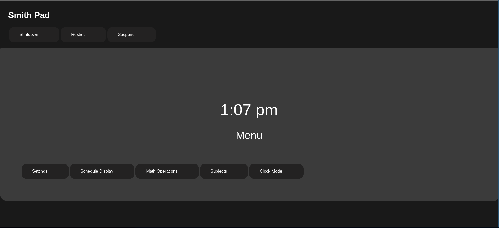

# Smith-Pad-OS-Shell-Interface

</img>

#### Introduction

> Brand new Interface for Smith-Pad-OS and Smith-Pad Web Interface

#### Requirements

- [ ] Arch Linux
- [ ] git
- [ ] php
- [ ] python
- [ ] xorg
- [ ] xorg-server
- [ ] xorg-xinit
- [ ] FOIL-UI-Framework-Library
- [ ] GNOME Libraries/Dependencies

#### Installation

`sudo pacman -S git`

`sudo pacman -S php`

`sudo pacman -S python`

`sudo pacman -S xorg`

`sudo pacman -S xorg-server`

`sudo pacman -S xorg-xinit`

# Make sure you are in in the root directory as root

`sudo su`

`git clone https://github.com/Smith-Pad/Smith-Pad-OS-Installation-Script`

`cd Smith-Pad-OS-Installation-Script`

# For now, checkout branch to fixing-stuff

## Eventually, it will be merged into the main branch`

`git checkout fixing-stuff`

`sh install.sh`

# Follow the instructions in the `install.sh script`

### Installation of `yay`

`git clone https://aur.archlinux.org/yay.git`

`cd yay`

`makepkg -si`

# TODO:

* Make a `namespace`

* Make a loop for the layouts 

* Make a switch statement for the UI Components
