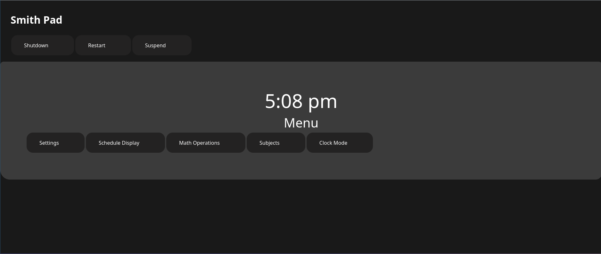

# Smith-Pad-OS-Shell Project

</img>

# Section 1:

#### Introduction

> Brand new Interface for Smith-Pad-OS and Smith-Pad Web Interface

#### Benefits of remaking the interface from the bottom up:

* Solving Accessiblility Issues for smaller to larger devices 

* Consistant UI Design view 

* Security issues with the original Smith-Pad-UI. 

* Replaced every UI component with FOIL-UI. 

* Integrating with Smith-Pad-OS. 

#### Requirements

- [ ] Arch Linux
- [ ] git
- [ ] php
- [ ] python
- [ ] xorg
- [ ] xorg-server
- [ ] xorg-xinit
- [ ] FOIL-UI-Framework-Library
- [ ] GNOME Libraries/Dependencies

#### Installation

`sudo pacman -S git`

`sudo pacman -S php`

`sudo pacman -S python`

`sudo pacman -S xorg`

`sudo pacman -S xorg-server`

`sudo pacman -S xorg-xinit`

### First you have to copy the systemd daemon. This allows systemd to automatically start the php service every time the system boots.

`cd systemd/system`

`cp shell-php.service /etc/systemd/system`

 `sudo cp shell-php.service /etc/systemd/system`

### Then you have to copy the shell script. This allows systemd to call the script to automatically start the php service every time the system boots.

`cd php-shell-script`

`cp shell-php.sh /usr/bin`

`sudo cp shell-php.sh /usr/bin`

### Then you have to enable and start the systemd daemon

`systemctl enable shell-php.service`

`systemctl start shell-php.service`

`sudo systemctl enable shell-php.service`

`sudo systemctl start shell-php.service`

###### It is recommended to check the status of the `shell-php.service` daemon using this command: `systemctl status shell-php.service`.

### Then you have to copy the xsessions file. This allows the ability to go to the Smith-Pad-OS-Shell via Display Manager.

`cd xsessions`

`cp shell.desktop /usr/share/xsessions`

###### Example Display Managers:

* GDM

* LXDM

* SDDM

### Then reboot the system. This is recommended so that the components will be fully ready for use.

`reboot`

`sudo reboot`

# 
